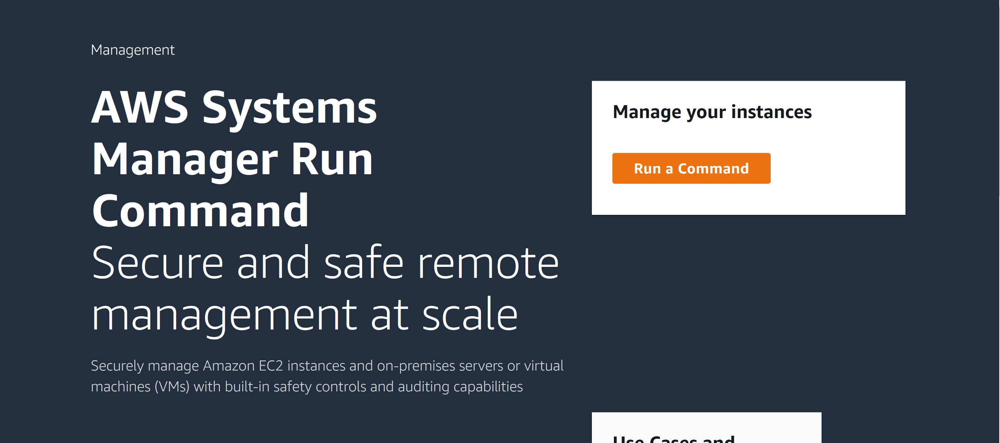
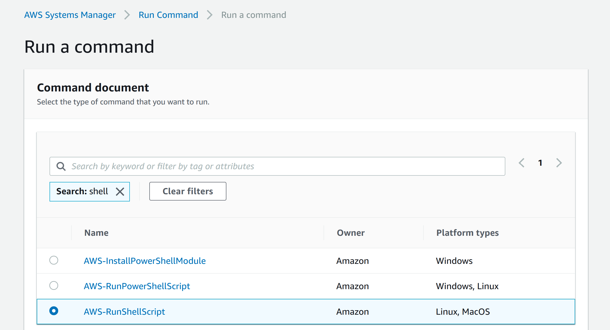
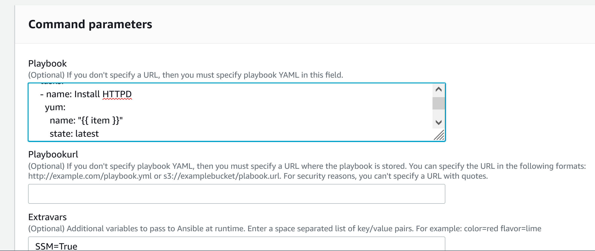
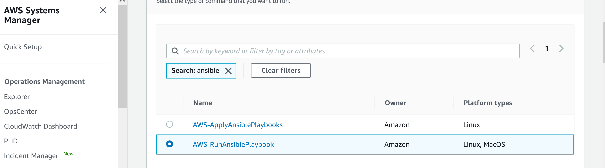
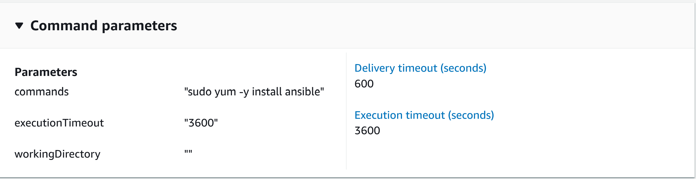
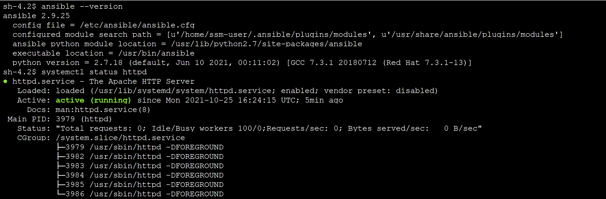

# IaC For Config Management - AWS State Manager and Run Command

AWS Systems Manager has two other important features when it comes to config management; State Manager and Run Command. These two features allows you to automate management tasks in a secure and easy to use way. Better security is provided over traditional SSH and incoming port 22 doesn't need to be open. All connections are audited by CloudTrail and permissions can be controlled using IAM. Ansible can now be used to deploy runbooks in a more secure fashion.
 
 
[Back to README](../README.md)

## Setting up the environment

Use the same cloudformation template (below) that is used in the Session Manager demo. This will create EC2's to connect to using Ansible  
* SSM-Without-Bastion.yml *- for accessing EC2 via Session Manager*
 

**State Manager and Run Command can deploy Ansible to EC2 and Remote VM's with Systems Manager Agent installed**

### Installing Ansible on target instances
Ansible must be installed on the EC2 instances you intend to use. That can be done during the bootstrap process but in this example you can install it manually or with `Run Command`. See below for installing

`sudo rpm -Uvh https://dl.fedoraproject.org/pub/epel/epel-release-latest-7.noarch.rpm` 
`sudo yum -y install ansible`

## Finished!

And it's as easy as that! In a few steps you've created SSM Session Manager endpoints for access to EC2 in private subnets AND with no open ports!
The benefit of having the SSM VPCE's is that you can now use Systems Manager to Run Commands, install updates and scan using Inspector. 
Check here for more info on Systems Manager [AWS SSM](https://docs.aws.amazon.com/systems-manager/latest/userguide/what-is-systems-manager.html)

## Author
Caylent Inc.

